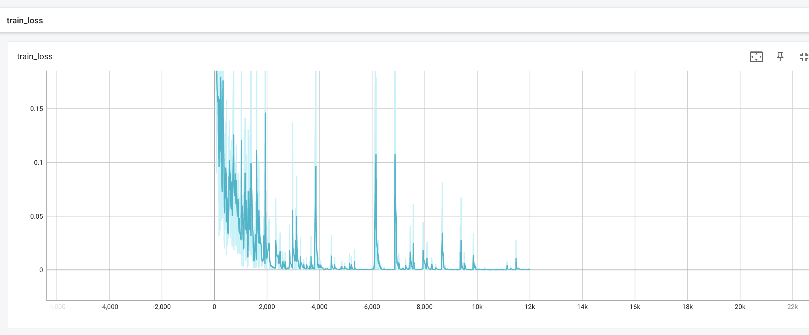

# CraudNlpProject
Train paraphrase recognition models for detecting related search queries.
Queries are considered close if they relate to the solution of the same user task.

## Collect dataset
Dataset wes collect using toloka.ai [Examples could be found here](img/examples):

Project settings:

|    |   |
|---|---|

Pool settings:

|   |   |
|---|---|

## Model
Using pytorch-lightning 
with base `bert-base-multilingual-cased` model 
achieved good quality on test dataset, and it cost just 10$.

Loss model with test **Accuracy** 78.67:

